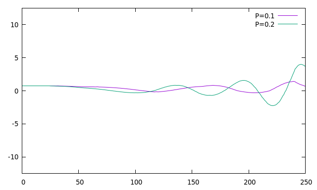
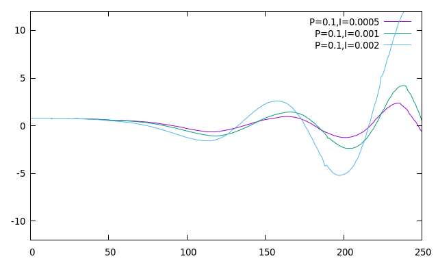
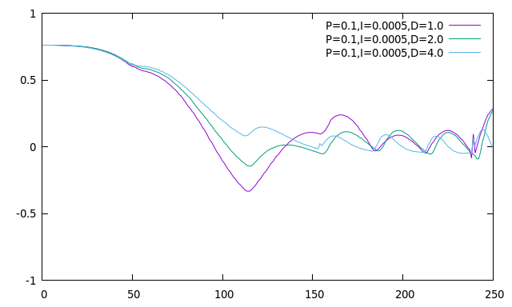
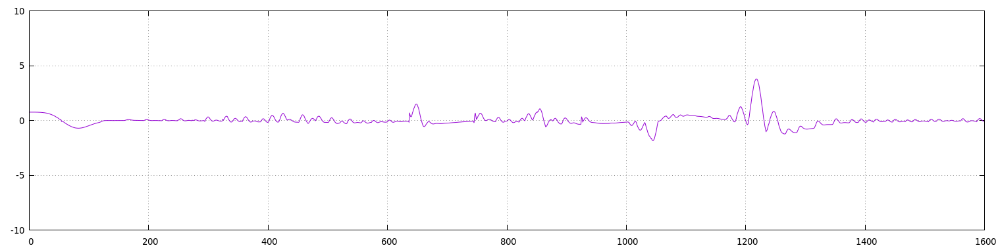

# CarND-Controls-PI
Self-Driving Car Engineer Nanodegree Program

## Reflection

#### *Describe the effect each of the P, I, D components had in your implementation.*
 
For this project, we have implemented a classic Proportional-Integral-Derivative ( or PID controller for short ) in C++ code. The PID controller is continuously passed the cross track error ( or c.t.e for short ) from the simulator and produces an output that is used to set the cars steering angle. The output of the controller is the negative of the sum of three components P, I and D.

* The P-Term is for the "Proportional"  part of the PID controller. The P contribution to the output is proportional to the c.t.e by an amount given by the hyperparameter Kp. If we set the Kp value too high, the car can overshoot the required trajectory. If too low then the car may not respond quickly enough to fast-changing cross-track errors, such as when going around a sharp bend. 

The chart below shows the cross track error from the simulator for the first 250 samples, showing the results when Kp is equal to both 0.1 and 0.2, the other components set to 0. The chart shows that when Kp=0.1,  it takes longer for the error to reach 0, but the error magnitude is lower.


* The I-Term is for the  "Integral" part of the PID controller. The I contribution to this output is the sum of all previous errors weighted by Ki. So if the car had a systematic drift to one side or the other, eventually the sum of this errors would be large enough to force it back on course.  The chart below shows 3 different Ki coefficients with a fixed Kp=0.1. The I term has caused the errors to be spread more evenly over positive and negative errors, at the cost of higher magnitude. 


* The D-Term or "Derivative" term. The D-Term in this code is the previous error minus the current error multiplied by the Kd parameter. Thus when the rate of change is small, the  D-Term would also be negligible, but when the change in error rate is more significant, then a more significant D action gets applied. So the D term helps dampen out the c.t.e. The chart below shows the output with Kp=0.1, Ki=0.0005 and Kd at 1,2 and 4. 



#### * Describe how the final hyperparameters, were chosen. *

Not being very ambitious, I set the throttle always to be at 0.4, and would manually tune with this in mind. As we also knew that the cross track error when the car was driving nicely, was roughly in the range [-10,+10]. It is reasonably apparent that Kp should be small say in the range [0,1], and Ki should be tiny if not 0 and Kd would probably be around 0-10. We then tried various combinations of these. 

I then decided to try and implement the twiddle algorithm; this was more complex than I had hoped. It required a quick peek of the Udacity simulator code, to see that it provided a "reset" message which would cause a reload of the Unity scene to the start of the track (  simulator should be run with root privileges - otherwise it may crash out after a couple of reloads  ). My auto-tuner class, would ignore the first 200 samples, then sum the next 1800, twiddle the parameters, compare to its best found so far, reset the simulator and then run another 2000 steps, and repeat. I used as a cost function "c.t.e^2 +  (100.0-speed)/100.0" the additional speed term helps if / when the car crashes out and stops but points in the right direction going 0 mph, and it is also an indication of quality - the firster the car goes the smoother the steering must be.   

After running for a few hours, the algorithm came up with the following as the best it could find was:- 

### Kp = 0.43463 , Ki = 0.00104  , Kd = 7.28484 

The chart below shows how the output has been kept to 0 as much as possible. A video of the car running with these parameters is shown.

